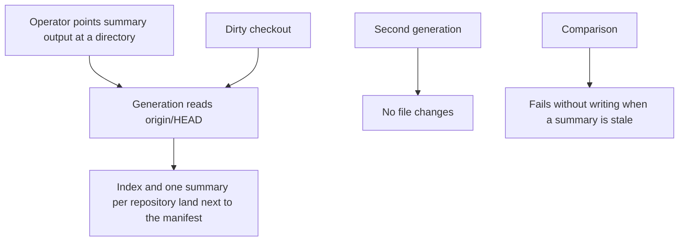

# Instruction: Write repository summaries

## Architecture projection

> Tree of the final files. ✅ create · ✏️ modify · ❌ delete

```txt
.
├── src/core/schema.ts
├── src/core/model.ts
├── src/core/manifest.ts
├── src/git/git.ts
├── src/context/
├── src/cli/commands/context.ts
├── src/cli/main.ts
├── src/index.ts
├── README.md
├── tests/manifest.test.ts
└── tests/integration.test.ts
```

## User Journey



## Tasks to do

### `1)` Summaries from the remote default branch

> A reader can see what each repository is without opening it, and a dirty tree does not leak in.

1. Accept an optional output directory on the manifest, defaulting to `ai/repos` beside the manifest file. Reject a directory that leaves that git or that contains a project.
2. Read each clone at `origin/HEAD` only. Write an index and one summary per project: identity, stack, scripts, tracked top level, README excerpt, agent-instruction links, fleet dependencies, and a manual section that survives regeneration.
3. A comparison writes nothing and fails when a summary is missing or different. Generating twice without a repository change rewrites nothing.
4. Clone and exec keep working when no summary is generated.

## Test acceptance criteria

| Task | Acceptance criteria                                                                                                                                                                                                                     |
| ---- | --------------------------------------------------------------------------------------------------------------------------------------------------------------------------------------------------------------------------------------- |
| 1    | A configured directory receives the index and one summary whose README text is the committed one, not a dirty edit. A second run changes nothing. A comparison fails without rewriting a hand-edited summary. Exec on a tag still runs. |
