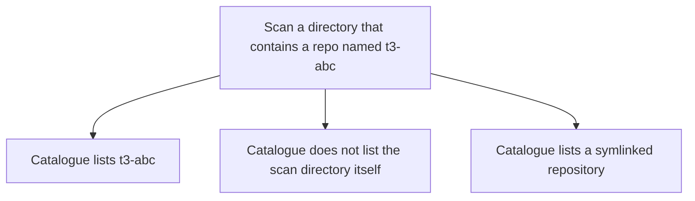

# Instruction: Drop the name filter

## Architecture projection

> Tree of the final files. ✅ create · ✏️ modify · ❌ delete

```txt
.
├── src/core/discover.ts          ✏️
├── tests/integration.test.ts     ✏️
└── README.md                     ✏️
```

## User Journey



## Tasks to do

### `1)` Remove the prefix skip

> A directory name is not a reason to skip a repository.

1. Delete the `t3-` name test from the scan.
2. Keep skipping the scan root, dot directories, dependency and build directories, and paths that leave the root.
3. Describe the scan without mentioning that prefix.
4. Cover a repository named `t3-abc` that has an origin: it is listed, the scan root is not, and a symlink still is.

## Test acceptance criteria

| Task | Acceptance criteria                                                                                           |
| ---- | ------------------------------------------------------------------------------------------------------------- |
| 1    | A dry-run scan lists `t3-abc` and the symlinked repository, and does not list the directory where it started. |
